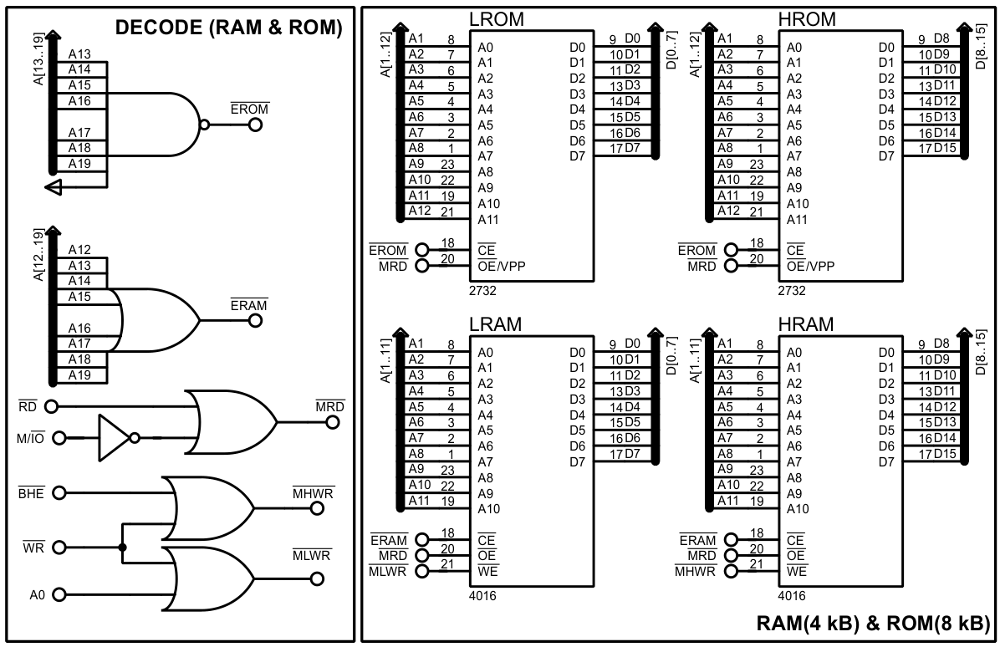

# Ejemplo 1

En un laboratorio de microbiología de un Instituto de Investigación se quiere controlar la apertura de este local por el máximo riesgo biológico que existe en el mismo. Para esto se diseña un sistema de control que posibilita realizar esta operación y que funciona de la siguiente manera:

Una tecla **ON** encenderá el panel formado por cuatro lámparas siete segmentos y que mostrarán inicialmente el signo menos, además de un led rojo para indicar puerta cerrada, esta tecla será atendida por interrupción. Un teclado matricial posibilitará la entrada de la contraseña para abrir la
puerta. Cuando la contraseña sea correcta se apagará el led rojo y se encenderá un led verde, en ese mismo instante sonará una bocina por 500 mili-segundos y en las lámparas de siete segmentos quedará presentado el cartel de **OPEN** por dos segundos, posteriormente el sistema volverá de
forma automática a su estado inicial y se apagará si se aprieta una tecla **OFF** que también será atendida **por interrupción**.

La contraseña de apertura de la puerta es: 13245.

## Hardware

El sistema a diseñar presenta diferentes elementos hombre/máquina; dígase: teclado matricial, display de cuatro lámparas siete-segmentos, dos indicadores led y una bocina. Para controlar estos elementos se necesita añadir al diseño periféricos para el control de entradas/salidas, temporizadores y un controlador de interrupción.

### Display de lámparas siete-segmentos

En confección del display de lamparas siete-segmentos se decide utilizar lámparas de ánodo común. Para controlar estas lámparas se estima conveniente utilizar la técnica de refrescamiento; de esta manera se reducen la cantidad de GPIO asociados al control de este elemento. Para ello se conectan todos los cátodos lámparas en paralelo a un arreglo de resistencias para limitar corriente que entra a cada GPIO; mientras que el ánodo de cada lámpara se conecta a un transistor PNP que controla el encendido de cada una de manera independiente.

La técnica de refrescamiento consiste en escribir en cada una de las lámpara el caracter a mostrar en un tiempo inferior a los 20 ms; de esta forma cuando se observa el display se pueden visualizar todas las lámparas encendidas con el caracter correspondiente. Esto se realiza estableciendo el patrón led encendidos y apagados en los pines A … G y encendiendo la lámpara correspondiente por los pines Ln.

### Teclado matricial

Para teclear la contraseña se implementa un teclado matricial numérico que a demás de contener los caracteres numéricos del ‘0’ al ‘9’ también integra las teclas ON y OFF.

*Esta configuración debería tener unas resistencias de pull-up en las columnas, pero a efectos prácticos de la simulación en Proteus® se omiten.*

Para atender a este teclado matricial es necesario rotar un bit en ‘0’por las filas, mientas se leen las las columnas (también se puede rotar por las columnas y leer por las filas)1. Si alguno de los bits de las columnas es cero esto indica que fue pulsada una tecla y para identificarla basta con establecer la relación filas vs columnas. Este procedimiento se puede simplificar agregando una compuerta NAND en las columnas como se muestra en la Figura 2. Al hacer esto la compuerta NAND pondrá su salida en ‘0’ si alguna tecla fue pulsada. De esta manera el algoritmo se simplifica a rotar el bit en ‘0’ por las filas esperando una interrupción por la salida del la compuerta NAND.

### Indicadores

Los últimos elementos indicadores y para visualizar estados son los dos diodos LED y la bocina. Respecto a los LED, estos se conectan desde la alimentación (Vcc) y resistencia limitadora de corriente a un GPIO de salida (para esta conexión los LED se encienden con ‘0’) como se muestra
en la Figura 3a. Para conectar la bocina se decide realizar una conexión con dos transistores NPN2 que permiten manejar tanto la potencia consumida por este elemento como la lógica de activación del mismo (Figura 3b). Uno de los transistores de esta configuración maneja la frecuencia (en este caso se escogió 200 Hz) y el otro controla si debe estar encendida o no.

*En la simulación en Proteus® se sustituyen estos transistores por una compuerta AND (ver esquemático).*

## Periféricos

Al analizar todos los elementos a controlar por el sistema basado en el microprocesador 8086; se puede definir que se necesita añadir al sistema: un puerto programable 8255, un temporizador 8254 (en este caso se utiliza el 8253 porque en proteus no existe el modelo del 8254) y un controlador de interrupciones 8259.

### Puerto programable 8255

El 8255 es el encargado de controlar el funcionamiento del display al conectar las señales de control del mismo al puerto A y el primer nible del puerto B. El segundo nible del puerto B se encarga de controlar los dos indicadores LED, la habilitación de dos temporizadores y el encendido de la bocina. Por otro lado, el puerto C se encarga de controlar el barrido del teclado matricial ya que este tiene la peculiaridad de poder utilizar los nibles alto y bajo como entrada o como salida de manera independiente.

### Temporizador/contador 8253

El primer temporizador del 8253 se utiliza para generar un tren de pulso con un ciclo útil del 50 % a 200 Hz. Esta señal tiene la función de establecer la frecuencia de refrescamiento del display (5ms por cada lámpara) y de generar la nota musical que sonará en la bocina (Sol # = 207.65 Hz). De esta señal se obtiene la una segunda señal pulsante con el segundo temporizador del 8253 para generar el tiempo que debe sonar la bocina (500ms). Con la señal obtenida anteriormente se genera el tiempo que debe estar el sistema en modo OPEN (2 s) con el tercer temporizador del 8253.

Asumiendo que se dispone de una señal de 1 MHz los temporizadores quedarían configurados de la siguiente manera:

| Parámetro         | Timer_0 | Timer_1 | Timer_2 |
|-------------------|---------|---------|---------|
| Modo              |   3     |    2    |    2    |
| Tamaño de palabra |  16bits |   8bits |  8bits  |
| Control de RW     | RW=0b11 | RW=0b01 | RW=0b01 |
| Recarga           | 0x270F  |  0x64   |  0x04   |

### Controlador de Interrupciones 8259

El 8259 se utiliza para controlar las distintas fuentes de interrupción del sistema según su prioridad. En la primera prioridad se encuentra la atención al teclado matricial, ya que además de las teclas numéricas también se encuentran los botones de ON y OFF. En el segundo nivel se encuentra la señal de refrescamiento del display (cada 5 ms). En un nivel inferior se encuentra la señal del tiempo de encendido de la bocina (500 ms) y en el cuarto nivel la señal del temporizador para el tiempo en OPEN del sistema (2 s).

## Decodificación de direcciones de periféricos

Para conectar los periféricos anteriormente mencionados se realiza un mapeo de cada una de las direcciones que ocuparía de manera consecutiva comenzando por la dirección 0x0300. Se debe tener en cuenta que para los periféricos conectados en direcciones impares se utiliza la parte alta del bus de datos (en este caso el 8253).

Si se observa detenidamente la tabla anterior se puede apreciar que todos los bits desde A4 al A15 del bus de direcciones se mantienen constantes para todas las posibles direcciones de los periféricos. Por tanto, esto sugiere utilizar una compuerta OR entre los bits del A4 al A15 y el M/IO negando los bits A8 y A9. De esta manera se obtiene parte de la decodificación del bus que es constante para todos los periféricos conectados. Si se analizan los bits del A0 al A3 del bus se puede apreciar que los bits A0 y A3 son constantes en las direcciones correspondientes a cada periférico; por ejemplo: los puertos PA, PB y PC y la palabra de control PCC (todos direcciones del 8255) se identifican con la combinación ‘00’ de A3 y A0. De igual manera pasa con las direcciones del 8253 y el 8259; que corresponderían a las combinaciones ‘01’ y ‘10’ de los bits A3 y A0 respectivamente. Con este análisis se puede conducir a una solución basada en un decodificador de dos bits utilizando las señales A0 y A3, mientras se utilizan las señales A1 y A2 para direccionar cada uno de los registros internos de cada periférico (ver Figura 4, Figura 5 y Figura 6).

## Demultiplexión de canales del 8086

El bus de direcciones y datos del 8086/8088 está multiplexado para reducir el número de terminales del circuito integrado. Para poder utilizar este procesador es necesario realizar una demultiplexión del bus y de esta manera poder acceder al bus de datos y direcciones de manera  independiente y poder conectar memorias y periféricos. Esta demultiplexión se logra utilizando el modo de conexión totalmente acoplado del 8086 que se explica a detalle en el libro de texto, que consiste a priori en añadir registros para retener las el bus de direcciones y buffers bidireccionales para evitar colisiones en el bus de datos.

## Mapa de memoria del sistema

Como el sistema a diseñar es relativamente simple y no precisa de un gran almacenamiento de datos ni de rutinas de software extremadamente complejas; se estima que estima que con 4 kB de memoria RAM estática y 8 kB de memoria ROM es más que suficiente. La asignación de esta memoria se realiza tal como se muestra en el mapa de memoria mostrado en la  siguiente tabla.

En este diseño se utilizan dos bloques de memoria SRAM de 2 k por 8 bits y dos bloques de memoria EEPROM de 4 k por 8 bits.

____

'<dezamora98@gmail.com>'
